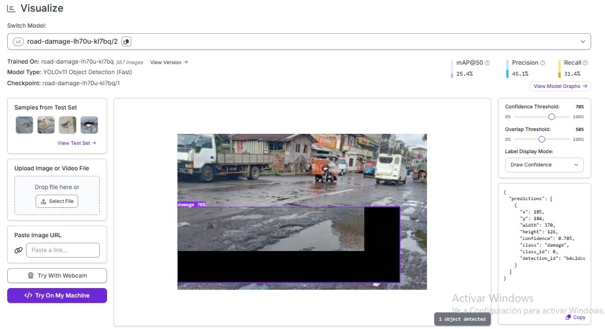

## Resultados del modelo

### Métricas del modelo

El modelo entrenado alcanzó los siguientes resultados:

- mAP@50: 25.4%
- Precision: 45.1%
- Recall: 31.4%

### Ejemplo de detección del modelo

El modelo detecta zonas de deterioro en pavimentos mediante bounding boxes utilizando YOLOv11.

### Gráficos de entrenamiento

Las curvas de entrenamiento muestran la evolución del aprendizaje del modelo:

- Box Loss  
- Class Loss  
- Object Loss

### Evaluación del umbral de confianza

#### Umbral 70%

Con un umbral de confianza de 70% el modelo continúa detectando daños en el pavimento.

#### Umbral 80%

Al aumentar el umbral a 80% el modelo deja de detectar algunos objetos, lo que muestra cómo el parámetro de confianza afecta la sensibilidad del detector.
